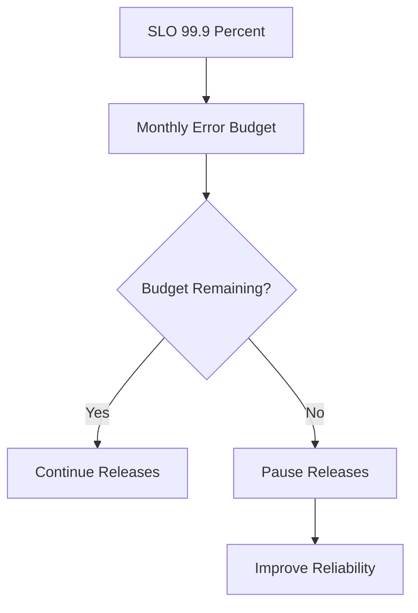

# Error Budget Flow

```mermaid
flowchart TD

    A[SLO 99.9 Percent]

    A --> B[Monthly Error Budget]

    B --> C{Budget Remaining?}

    C -->|Yes| D[Continue Releases]

    C -->|No| E[Pause Releases]

    E --> F[Improve Reliability]
```