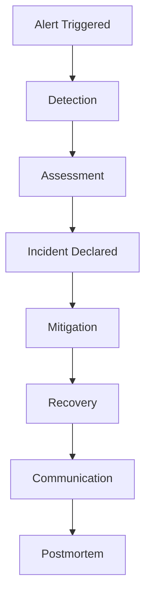

# Incident Workflow

```mermaid
flowchart TD

    A[Alert Triggered]
    B[Detection]
    C[Assessment]
    D[Incident Declared]
    E[Mitigation]
    F[Recovery]
    G[Communication]
    H[Postmortem]

    A --> B
    B --> C
    C --> D
    D --> E
    E --> F
    F --> G
    G --> H
```