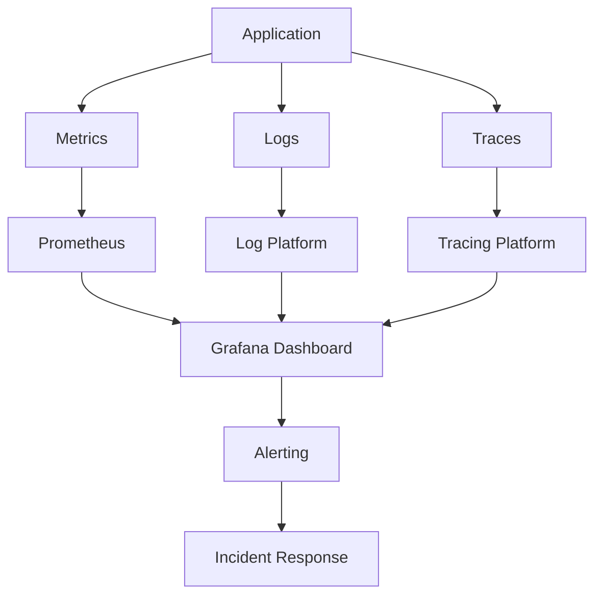

# Observability Model

```mermaid
flowchart TD

    A[Application]

    A --> B[Metrics]
    A --> C[Logs]
    A --> D[Traces]

    B --> E[Prometheus]
    C --> F[Log Platform]
    D --> G[Tracing Platform]

    E --> H[Grafana Dashboard]
    F --> H
    G --> H

    H --> I[Alerting]

    I --> J[Incident Response]
```