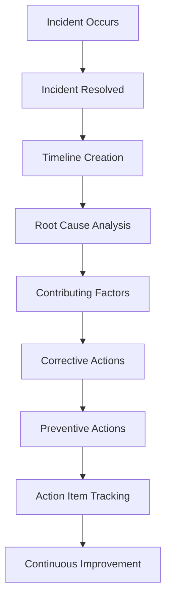

# Postmortem Workflow

```mermaid
flowchart TD

    A[Incident Occurs]
    B[Incident Resolved]
    C[Timeline Creation]
    D[Root Cause Analysis]
    E[Contributing Factors]
    F[Corrective Actions]
    G[Preventive Actions]
    H[Action Item Tracking]
    I[Continuous Improvement]

    A --> B
    B --> C
    C --> D
    D --> E
    E --> F
    F --> G
    G --> H
    H --> I
```