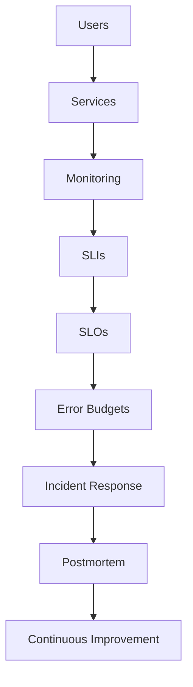

# Reliability Lifecycle

```mermaid
flowchart TD
    A[Users]
    B[Services]
    C[Monitoring]
    D[SLIs]
    E[SLOs]
    F[Error Budgets]
    G[Incident Response]
    H[Postmortem]
    I[Continuous Improvement]

    A --> B
    B --> C
    C --> D
    D --> E
    E --> F
    F --> G
    G --> H
    H --> I
```