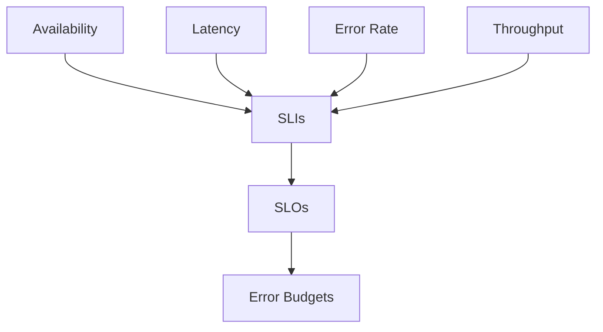

# SLI to SLO Model

```mermaid
flowchart TD

    A[Availability]
    B[Latency]
    C[Error Rate]
    D[Throughput]

    A --> E[SLIs]
    B --> E
    C --> E
    D --> E

    E --> F[SLOs]

    F --> G[Error Budgets]
```